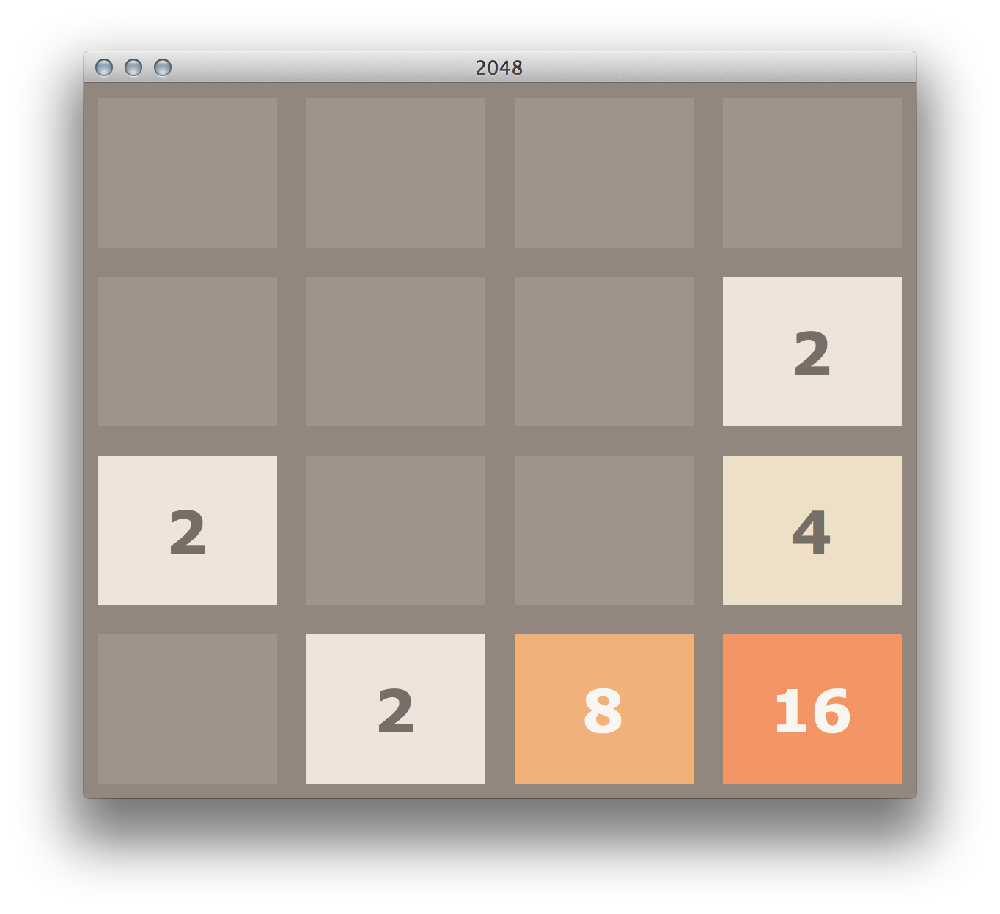

# CS181-project-2048

这是一个**修改版 2048**（Python + Tkinter UI），并实现了 4 类智能体（Agent）：

- **Minimax**
- **Expectimax**
- **DQN（Deep Q-Network）**
- **Actor-Critic（强化学习）**


---

## 目录结构（更新后）

```
CS181-project-2048/
├─ puzzle.py                 # UI / 游戏入口
├─ logic.py                  # 2048 核心逻辑（移动、合并、胜负判断等）
├─ constants.py              # 常量与 UI 配置（按键、配色、网格大小等）
├─ Agents/                   # ✅ 所有 agent 与训练脚本
│  ├─ __init__.py
│  ├─ agent_Minimax.py
│  ├─ agent_Expectimax.py
│  ├─ agent_Qlearning.py     # DQN
│  ├─ agent_ActorCritic.py   # Actor-Critic（RL）
│  ├─ train_dqn.py           # 训练 DQN（模型保存到 Data/）
│  └─ train_actor_critic.py  # 训练 Actor-Critic（模型保存到 Data/）
├─ Data/                     # ✅ 所有“数据/模型/训练产物”
│  ├─ dqn_2048_model.pth
│  ├─ actor_critic_2048_model.pth
│  └─ collected_data/        # RL dataset
└─ Reports/                  # Evaluation data
└─ Evaluation/               # Evaluation visualization
└─ img/                      
```

---

## Getting Start

- Python 3.11+
- Tkinter（多数 Python 自带）
- `numpy`
- `torch`

本地下载与安装依赖：

```bash
git clone https://github.com/RogerFyc/CS181-project-2048.git
cd CS181-project-2048
pip install -r requirements.txt

```

---

## 运行 UI（Human / AI）

在项目根目录运行：

```bash
python puzzle.py
```

### UI 上怎么玩/怎么用 AI

- **Controller**：选择 `Human` 或 `AI`
- **AI Type**：选择 `Minimax / Expectimax / DQN / ActorCritic`
- **Auto-play**：勾选后 AI 会持续自动走；取消勾选后可用 “单步” 运行

### 键盘快捷键（默认）

- 方向键 / WASD：移动（Human 模式）
- `m`：切换 Controller（Human ↔ AI）
- `t`：循环切换 AI Type（Minimax → Expectimax → DQN → ActorCritic → …）
- `space`：AI 单步执行（仅在 AI 模式且关闭 Auto-play 时）
- `r`：Restart
- `Backspace`：Undo（回退一步）
- `Esc`：Quit（退出）

---

## 训练：DQN

训练脚本默认把模型保存到 `Data/dqn_2048_model.pth`：

```bash
python Agents/train_dqn.py --episodes 500
# 或作为模块运行：
python -m Agents.train_dqn --episodes 500
```

常用参数示例：

```bash
# 更长训练 + 更低学习率
python Agents/train_dqn.py --episodes 20000 --save-freq 1000 --learning-rate 0.0005
```

继续训练（从已有模型加载）：

```bash
python Agents/train_dqn.py --episodes 5000 --load-path Data/dqn_2048_model.pth --save-path Data/dqn_2048_model_v2.pth
```

训练好后，运行 UI 并在 **AI Type** 里选择 `DQN`，程序会尝试自动加载：
- `Data/dqn_2048_model.pth`

---

## 训练：Actor-Critic （RL）

训练脚本默认把模型保存到 `Data/actor_critic_2048_model.pth`：

```bash
python Agents/train_actor_critic.py --episodes 500
# 或作为模块运行：
python -m Agents.train_actor_critic --episodes 500
```

如果你要用 `Data/collected_data/` 中的轨迹数据训练：

```bash
python Agents/train_actor_critic.py --use-collected-data --data-dir Data/collected_data --num-epochs 10
```

训练好后，在 UI 里选择 `ActorCritic`，程序会尝试自动加载：
- `Data/actor_critic_2048_model.pth`

---

## License

This project is licensed under the MIT License. See [LICENSE](LICENSE) for details.

## Attribution

This repository is a derivative work based on:

* **2048 Python** by Tay Yang Shun (yangshun/2048-python), MIT License

And ultimately inspired by:

* **2048** by Gabriele Cirulli (gabrielecirulli/2048), MIT License
